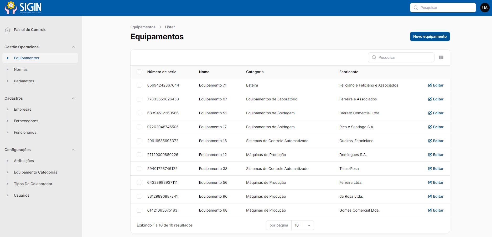

# SIGIN - Sistema Integrado de Gestão Industrial

## Visão Geral
SIGIN é um sistema ERP inovador projetado para atender às complexas necessidades da gestão industrial. Integrando processos administrativos, financeiros, de produção e IoT (Internet of Things), o SIGIN oferece uma solução completa para a eficiência energética e manutenção industrial.

*Figura: Print da Proof of Concept (POC) do SIGIN, demonstrando a integração com os arduínos para controle de sensores industriais.*

*Figura: Print de demonstração do sistema.*

## Recursos do SIGIN
- **ERP Modular e Personalizável:** Adapta-se perfeitamente às necessidades específicas de cada cliente.
- **Acessibilidade e Inclusão:** Interface responsiva com modos de exibição customizáveis, incluindo alto contraste e leitura assistida.
- **Integração Parametrizável com Dispositivos e Maquinário Industrial:** Flexibilidade na integração com uma variedade de dispositivos e maquinário, independente do fabricante.
- **Suporte Técnico Especializado:** Acompanhamento contínuo e suporte técnico para garantir uma implantação e operação eficientes.

## Código Fonte
O código fonte para a POC que realiza a integração com os arduínos controlando os sensores industriais está disponível para avaliação. Nesta POC, demonstramos a capacidade do SIGIN de se conectar com o hardware industrial e coletar dados essenciais para a gestão eficiente de processos industriais.

## Licença
Este projeto e todos os seus conteúdos estão protegidos sob a lei de direitos autorais. Todos os Direitos Reservados. Qualquer uso, distribuição, reprodução ou modificação do trabalho sem a autorização explícita do detentor dos direitos é estritamente proibido.

---

Para mais informações, entre em contato conosco através de [ghinozzi@gmail.com](mailto:ghinozzi@gmail.com).

